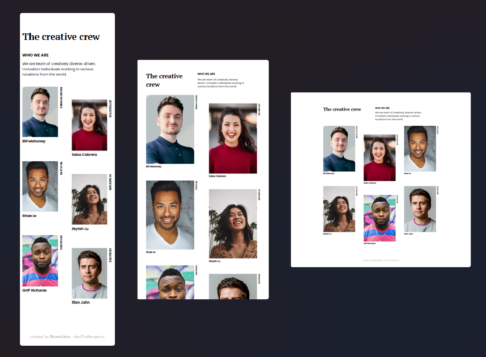

<!-- Please update value in the {}  -->

<h1 align="center">My Team Page</h1>

   Solution for a challenge from  <a href="http://devchallenges.io" target="_blank">Devchallenges.io</a>.

  <h3>
    <a href="https://my-team-page-brunolyma.vercel.app/">
      Demo
    </a>
     | 
    <a href="https://devchallenges.io/solutions/EFLzIligyCm8VNTXzI7v">
      Solution
    </a>
     | 
    <a href="https://devchallenges.io/challenges/hhmesazsqgKXrTkYkt0U">
      Challenge
    </a>
  </h3>

<!-- TABLE OF CONTENTS -->

## Table of Contents

- [Overview](#overview)
  - [Built With](#built-with)
- [Features](#features)
- [Contact](#contact)
- [Acknowledgements](#acknowledgements)

<!-- OVERVIEW -->

## Overview

Introduce your projects by taking a screenshot or a gif. Try to tell visitors a story about your project by answering:

- Where can I see your demo?

      You can see it in Vercel deploy and in my DevChallenges profile.

- What was your experience?

      In this second challenge on the DevChallenge platform, I realized that a lib like React speeds up development. The use of components and an object would make the lines of code easier and shorter in the images part, but it was good to practice without frameworks. Always priorityzing the responsive layout and mobile first concept.

- What have you learned/improved?

      I reinforced the knowledge in FlexBox and the use of CSS pseudo-classes like :nth-chlid() and its even/odd arguments and 3n + 2 (the second element in a group of three). And the use of the writhing-mode property.

### Built With

- [CSS](https://developer.mozilla.org/pt-BR/docs/Web/CSS)
- [HTML](https://developer.mozilla.org/pt-BR/docs/Web/HTML)

## Features

This application/site was created as a submission to a [DevChallenges](https://devchallenges.io/challenges) challenge. The [challenge](https://devchallenges.io/challenges/hhmesazsqgKXrTkYkt0U) was to build an application to complete the given user stories.

## Acknowledgements

- [Steps to replicate a design with only HTML and CSS](https://devchallenges-blogs.web.app/how-to-replicate-design/)
- [Figma](https://www.figma.com/)
- [Marked - a markdown parser](https://github.com/chjj/marked)

## Contact

- Website [Portfolio](https://brunolima-portfolio.vercel.app/)
- GitHub [@ybrunolyma](https://github.com/brunolyma)
